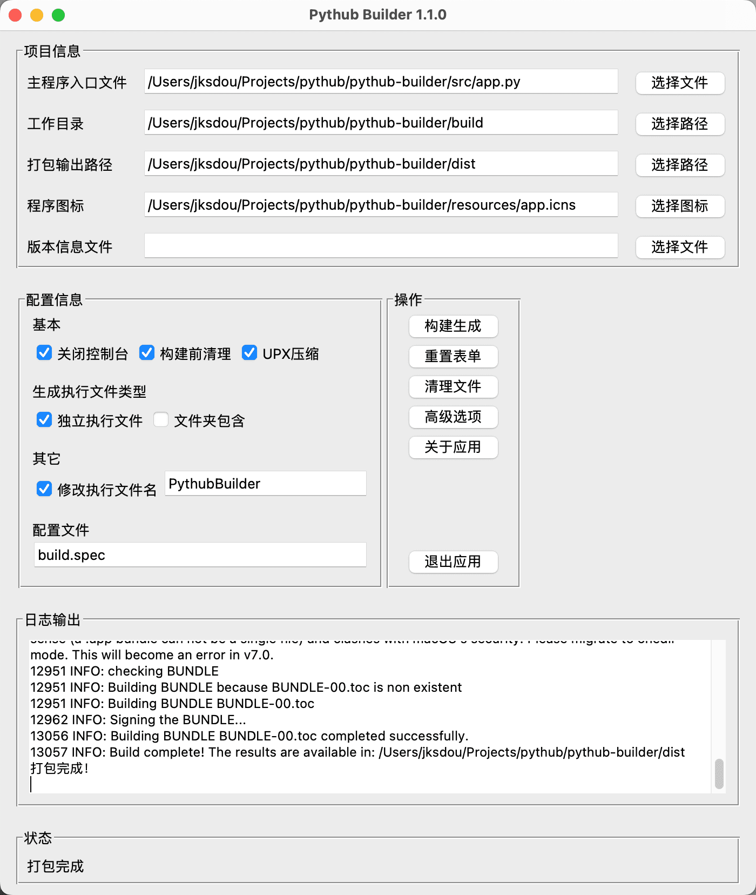

# Pythub Builder - PyInstaller 图形化打包工具



## 项目概述

一款基于 Tkinter 开发的图形化工具，用于简化 PyInstaller 打包 Python 脚本的操作。通过可视化界面配置打包参数，自动生成可执行文件，支持 Windows/Linux/macOS 多平台。

## 功能特性

- **核心功能**

  - 📦 一键打包 Python 脚本为独立可执行文件
  - 🖼️ 支持自定义程序图标（.ico/.icns）
  - 📄 添加版本信息文件（.rc）
  - 📁 灵活设置工作目录和输出路径

- **配置选项**

  - ✔️ 生成独立文件（--onefile）或文件夹包（--onedir）
  - ✔️ 关闭控制台窗口（--noconsole）
  - ✔️ UPX 压缩（--upx）
  - ✔️ 构建前清理临时文件（--clean）
  - ✔️ 自定义 EXE 文件名（--name）

- **辅助功能**
  - 📜 实时日志输出显示
  - 🚦 状态栏进度反馈
  - 🔄 表单重置与日志清理
  - 🛑 安全退出机制

## 使用说明

### 快速开始

```bash
克隆仓库
git clone https://github.com/Crogram-Pythub/pythub-builder.git

安装依赖
pip install pyinstaller tkinter

启动应用
python src/app.py
```

### 操作指南

1. **选择主程序**

   点击 "选择文件" 按钮指定要打包的 `.py` 文件

2. **配置路径**

   - 工作目录：临时构建文件存放路径（默认：`项目路径/build`）
   - 输出目录：最终 EXE 文件生成路径（默认：`项目路径/dist`）

3. **高级设置**

   - 勾选 "UPX 压缩" 减小文件体积（需提前安装 UPX）
   - 指定版本信息文件添加版权信息

4. **执行打包**

   点击 "构建生成" 按钮启动打包流程，实时日志将显示构建进度

## 配置参数对照表

| 界面选项     | PyInstaller 参数 | 说明                           |
| ------------ | ---------------- | ------------------------------ |
| 独立执行文件 | `--onefile`      | 生成单个可执行文件             |
| 文件夹包含   | `--onedir`       | 生成包含依赖的文件夹           |
| 关闭控制台   | `--noconsole`    | 隐藏命令行窗口（GUI 程序必备） |
| UPX 压缩     | `--upx`          | 使用 UPX 压缩可执行文件        |
| 构建前清理   | `--clean`        | 清除缓存文件                   |

## 依赖项

- Python 3.7+

- 必需库：

  ```requirements.txt
  PyInstaller==5.4.1
  tkinter==0.1.0
  ```

## 代码结构

```
pythub-builder/src
├── src/app.py         # 主程序入口文件
├── src/view.py        # 主程序界面和逻辑
├── src/utils.py       # 工具函数（窗口控制/路径检测/退出确认）
├── resources          # 资源文件（图标/截图）
├── build.sh           # 项目打包脚本
└── README.md          # 项目文档
```

## 常见问题

**Q：打包时报错 "PyInstaller 未找到"**

✅ 解决方案：

```bash
pip install --upgrade pyinstaller
```

**Q：如何添加自定义图标？**

✅ 操作步骤：

1. 准备 256x256 像素的 `.ico` (Windows) 或 `.icns` (macOS) 文件
2. 通过 "选择图标" 按钮加载图标文件

**Q：版本信息文件格式要求**

🔍 参考：[微软版本资源文件规范](https://docs.microsoft.com/en-us/windows/win32/menurc/versioninfo-resource)（[VERSIONINFO resource](https://learn.microsoft.com/zh-cn/windows/win32/menurc/versioninfo-resource)）

## 问题反馈

Please file an issue at [Issues](https://github.com/Crogram-Pythub/pythub-builder/issues).

## 许可证

Pythub Builder is released under the [BSD 3-Clause License](LICENSE)

## 作者

[Jackson Dou](https://github.com/jksdou)

## 版权

© 2025 [Crogram](https://crogram.org/)

## 其他

网站：[pythub.org](https://pythub.org/)

